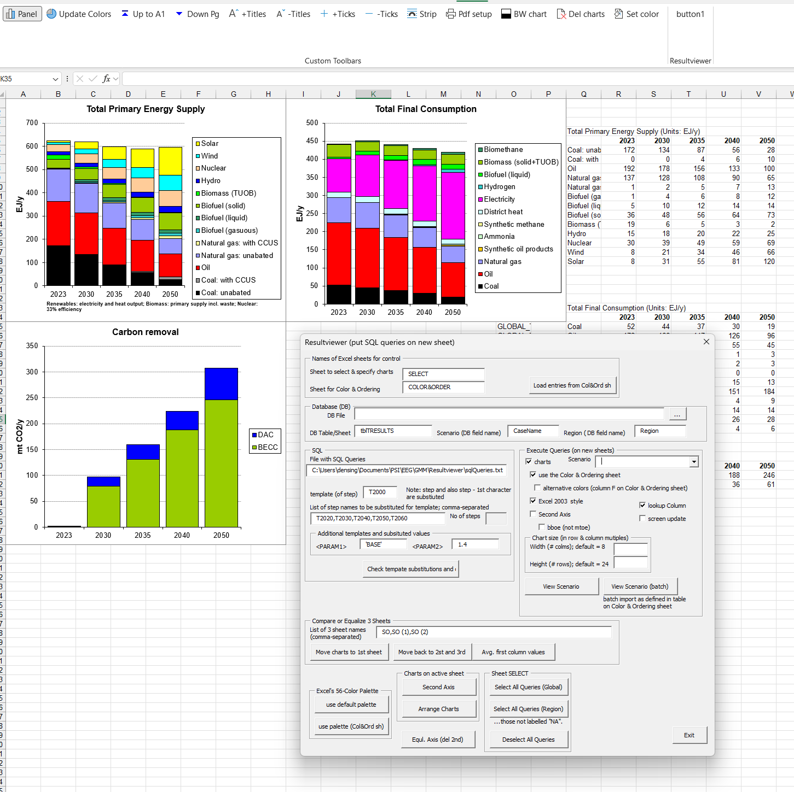

# Resultviewer (SQL in Excel)

> Select tabular data from Excel (or other tabular data sources) and chart it. Put hundreds of charts in seconds.

> Automatically group the chart by special data columns, e.g. group by "scenarios"

> To specify SQL queries of data tables that have many columns, you can use a template to select multiple columns that have similar names (e.g., if time-steps are in columns; for example, "T2025", "T2035", etc.)

> You can easily adapt the Resultviewer because it is implemented in VBA inside Excel (just press the usual `Alt+F11` to open the VBA code editor of Excel).

Note: The Resultviewer was originally designed for **multi-regional energy system models**, where 

- the horizontal chart axis are time steps,
- the charts are grouped by scenario and by region,

Hence, some naming conventions originate from there.

## Short Description

> The Resultviewer is an MS Excel file with VBA-macros that executes an arbitrary number of SQL-queries on tabular input data, and puts the extracted result tables together with optional charts on new Excel sheets.
- Currently implemented input tables: A sheet in another Excel-file (.xslx), or a table of an MS Access database (.mdb)
- The SQL-queries are specified in a separate text (.txt) file 

## Capabilities

- **Chart customization:** Type (column, line etc.), color, order of rows, labels, size, second axis
- **Multiple charts by scenario and region:** The same SQL-query can be executed for several scenarios and regions ('scenario' and 'region' can be any columns (field names) in input table). For this, you write in the SQL-query `<SCENARIO>` and `<REGION>`, and these tags will be substituted by different values of selected scenarios and regions.
- **Templates for time steps:** In the SQL-queries, time steps are usually table columns, which can mean tediously long SELECT statements if many time steps are involved. Therefore, a template can be used in the SQL-queries, such that only a single time-step (i.e. the template) has to be entered manually. Note: If time steps are in different rows in the input table, use the `TRANSFORM...PIVOT` command.
- **Comparison of scenarios:** In the Resultviewer, a new scenario is put on a new sheet. For better comparison, vertical axes can be levelized across sheets, and charts of three scenarios can be put on a single sheet for side-by-side comparison.

The example output scenario sheet `GMM` shows the capabilities for a multi-regional energy system model with many different charts. The corresponding file `sqlQueries.txt` and the sheets `COLOR&ORDER` and `SELECT` show how this output was specified. On request, the original ACCESS DB can be provided.

## Description/How to use

To control the table and chart generation, the Resultviewer uses a control panel and settings specified in two Excel sheets:
1. The **control panel** can be accessed via the ribbon of Excel at tab `Add-in` (make it visible if not yet): You see a row of buttons. Press `Panel`, which opens the control panel of the Resultviewer
2. The two sheets for control are `SELECT` and a `COLOR&ORDER`; the names of these sheets can be determined in the panel, such that different settings can be used; for our global energy system model, and also generally in this documentation, we use the names `SELECT` and `COLOR&ORDER`; the example uses `SELECT_Example` and `COLOR&ORDER_Example`.  

### Run the example

1. Download from this site the three files: 
	- `Resultviewer_NT.xls`,
	- `sql_queries_Example.txt`,
	- `WEO2024.xlsx`.
2. Open `Resultviewer_NT.xls`. Activate Macros in Excel: File -> Options -> Trust Center -> Macro Settings -> Enable: VBA macros & Trust access. If there is still a Macro problem, right-click the resultviewer-file in Windows Explorer -> Properties: "Security: This file came from another computer..." -> Trust. 
2. Check that in the Excel-ribbon the tab "Add-ins" shows the items "Panel", "Update Colors", etc. Open the "Panel", then you can press "Exit" again. In the following, we will load into the panel the settings to run the example. Later on, you can also enter settings in the panel directly. The settings are pre-stored in the sheet `COLOR&ORDER_Example' as follows. 
3. In the Resultviewer, go to sheet `COLOR&ORDER_Example`. Look out for the table a little bit on the right ("LoadUser"). This table has the paths to the input table `WEO2024.xlsx` and the SQL queries `sql_queries_Example.txt`. Adjust the paths to the locations of your versions of these files. 
5. In the opened panel, adjust the name of the color & ordering sheet to `COLOR&ORDER_Example`, and press `Load` to load the values into the panel. Now, the panel should have the correct values of the example. Clearly, you could have entered the values also manually directly in the control panel.
6. In the control panel, select a scenario in the drop-down box.
7. In the control panel, press `View Scenario`.

## Remarks

- **Ordering of the charts**: The order of the SQL-queries (in the separate text file) determines the order of the generated charts. The info-line of each query and the number of the SQL-query is put on the `SELECT` sheet. You can skip an SQL query by deselecting it in the `SELECT` sheet.
- Some information (scenario, execution date etc.) is put in cell `A1` and following (hidden behind the first chart)

## Colors

Colors can be fully customized. In the Resultviewer, colors are specified by the colorindex in Excel, which is a number between 1-57 of Excel's color palette. The following options exist:

- **Standard color scheme:** Colors for each chart series can be specified in the `COLOR&ORDER` sheet in column `D`. To see the color of a colorindex that you want to choose, the table `Excel Palette` lists all colors. Press `Update Colors` in the ribbon to see all colors updated.
- **Alternative color scheme:** An alternative scheme can be entered in the next column `E` on the `COLOR&ORDER` sheet. In the panel, you can tick whether this alternative colors should be used for chart import. As a special feature of this alternative scheme, in the next column `F`, you can enter a letter `s` such that the color is shaded with diagonal strips. 
- **Custom Excel color palette:** If you need other colors than available in the standard Excel palette, you can specify your own palette in table `Palette` on the `COLOR&ORDER` sheet by re-defining a colorindex 1-57 to a RGB value (e.g. `255,0,0` for red). Press `use palette (Color&Order sheet)` in the panel to use the new definitions. Note: Not all colorindices have to be re-defined, and any order of indices is allowed.
- **Coloring the interior of a selected Excel object:** If you need to alter the interior color of a single object (e.g. a chart series in a single chart), press `Set color` in the ribbon. This will open a dialogue, where you can select the colorindex. 

## Templates in the SQL-queries

- **`<TABLE>`:** will be replaced by the table name as specified in the control panel. Note: Excel sheet names must be entered with a dollar: `Sheet1$`. 
- **`<SCENARIO>`:** will be replaced by the scenario as selected in the drop-down box in the control panel 
- **`<REGION>`:** will be replaced by a comma-separated list of region names (can be a single regions, e.g. `'World'`) as specified in the `SELECT` sheet
- **`<PARAM1>`, `<PARAM2>`:** Auxiliary parameters given as specified in the control panel.
- **`<TMPL>...<TMPL>`:** In the SQL-queries, time steps are usually table columns,  which can mean tediously long SELECT statements if many time steps are involved. Therefore, a template can be used such that only a single template-time-step has to be entered manually. The template is entered for example as `SELECT ..., <TMPL> ... X2000 ... 2000 ... (repeated in any order possible)  <TMPL>`. Then, if `X2000` is the template specified in the control panel, the template `X2000` and also `2000` (without the first character) will be replaced by the list of names as specified in the control panel.
- **`<TMPL>...$...<FAC> 1.2, 2.5, 3 <TMPL>`:** It is also possible to provide a number specific for each generated column. The numbers replace the placeholder `$`. If the list of numbers is too short, the last number of the comma-separated list is repeated for the remaining columns.

## Issues (ToDo)

 - The start of SQL queries in the text file is identified by the SQL keywords `TRANSFORM` or `SELECT`. Currently, the code searches for uppercase keywords only (SQL syntax is case-insensitive).
- The `<FAC>` template is not fully tested. 
- In the SQL-textfile, allow comments inside SQL queries (by using a comment-prefix)

## FAQ

- **Why use Excel?** Both charts and the data are available at the same place, and you have all the advanced Excel features available for example for ex-post calculations, adjusting the charts, and copy-paste.
- **Why is the Resutviewer provided in .xls format, and not in .xslm format?** Indeed, you can save the `.xls` as `.xlsm`  without problem. We found that the `.xls`  format is more stable if many charts are generated and also for VBA macros, despite that `.xlsm` is a newer format and is advertized as more stable. Also `.xls` is faster, perhaps also due to the fact that `.xls` is limited to 65'000 rows, whereas `.xlsm` can have 1 mio. rows and more columns.  
- **Why use macros (VBA, Visual Basic for Application), instead of newer interfaces to Excel, for example by using Python/VB/C#?** By our tests, VBA is up to three times faster then other connection, which is due to the time-consuming so-called Marshalling (VSTO). Also, the VBA code is directly accessible for any users inside Excel, and can be easily adapted in the code editor (press `Alt+F11`).

## Limits

- Names in the column-header "scenario" should be less than 27 characters long because they will become sheet names (32 char sheetname limit of Excel): If duplicated, a number in parentheses will be appended, e.g. (2)
- Not more than approx. 1000 charts are possible in Excel (counted over all open Excel workbooks). With more charts, Excel gives errors ("out of memory", "file cannot be saved" etc.). 1000 charts is easily reached, e.g. with 20 regions, 20 scenarios, 30 charts per scenario. In general, if you have several Resultviewers open at the same time, Excel may become unstable, and files cannot be saved.

### Limits of the JET-engine 

For queries on Excel-sheets and MS Access, the Microsoft ACE/JET-engine with interface AOD is used. This engine has limits, but has also the advantage of the PIVOT-table functionality by using the keyword `TRANSFORM` as is used in the example. The limits are: 
 
- SWITCH and nested IFF statements can have maximal 15 levels (otherwise the SQL-engine gives an error: "SQL query too complex").
- Comments inside SQL queries are not allowed
- A query cannot consist of several sequential SELECT statements, separated by a semicolon, as would be possible in other DB engines
- The SQL syntax and table headers are case-insensitive
- The used interface AOD uses % in LIKE (and not * as is possible MS Access)

## Background: DAO/ADO/JET
- The Resultviewer currently uses ADO for MS Access databases (.mdb) and Excel.
- ADO (ActiveX Data Objects): Uses OLE DB (Object Linking and Embedding) programming interface. OLE DB is based on the Microsoft Component Object Model (COM). The older DAO (Data Access Objects) is deprecated in favour of ADO.
- ACE/Jet has an "ANSI Query Mode" (resembles ANSI/ISO SQL-89 and SQL-92 Standards). ADO interface (OLE DB) uses ANSI-92 Query Mode ('SQL Server compatibility mode'). The MS Access user interface, from the 2003 version onwards, can use either query mode (* or % in LIKE). So be aware: A query may work in MS Access user interface, but not with DAO or ADO. In ODBC the query mode can be explicitly specified via the ExtendedAnsiSQL flag. ACE/Jet SQL syntax has an ALIKE keyword, which allows the ANSI-92 Query Mode characters (% and _) regardless of the query mode of the interface

